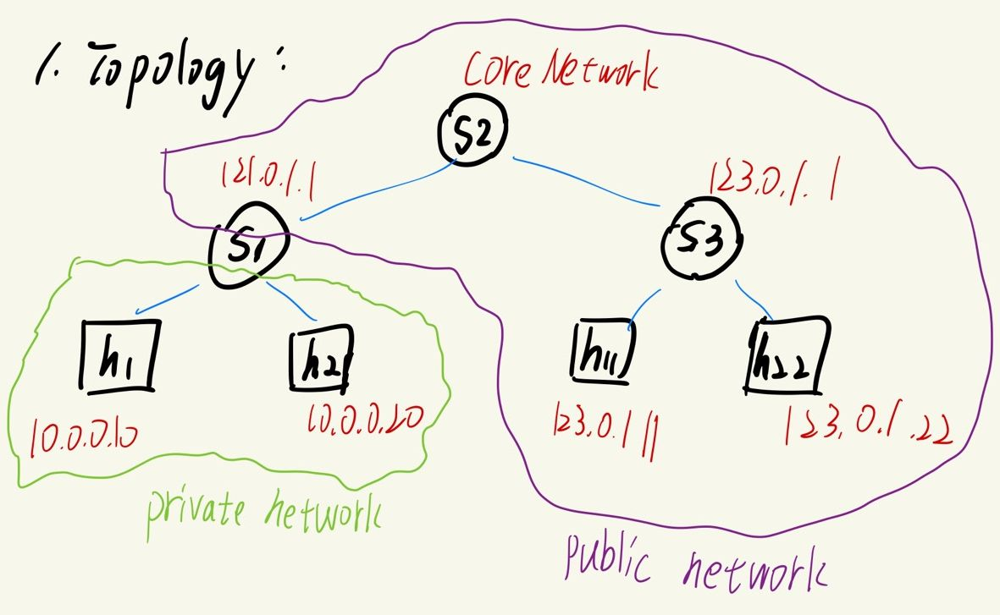

[comment]: # (SPDX-License-Identifier:  Apache-2.0)

# Simple NAT Implementation Using P4_16

## 目錄

- [Simple NAT Implementation Using P4\_16](#simple-nat-implementation-using-p4_16)
  - [目錄](#目錄)
  - [1.功能簡介](#1功能簡介)
    - [功能](#功能)
    - [網路拓撲](#網路拓撲)
  - [2.環境介紹](#2環境介紹)
  - [3.運行方式](#3運行方式)
  - [4.重點技術](#4重點技術)
  - [5.成果](#5成果)
  - [6.問題與解決辦法](#6問題與解決辦法)
  - [7.參考資料](#7參考資料)

## 1.功能簡介

### 功能

本專案使用P4程式語言實做NAT(Network Address Translation)，網路位址轉譯功能。

專案中只使用P4語言設計Switch的data plane pipeline流程，使原先未支援NAT功能之Switch也能實現IP轉譯功能。本專案主要利用到P4中的register功能來紀錄**對外的Port號/Identifier**與對應的**內網使用者之Port號/Identifier與IP**，使Switch在處理外部Server傳遞的Packet時，可透過dstPort/Identifier來找到對應的內網使用者。

本專案目前只支援常見之**ICMP Ping、TCP、UDP**協定(Protocol)轉譯功能，其他Layer 4 Protocol(e.g. DCCP、SCTP)和ICMP功能不確定是否可以轉譯成功。

測試方面，本專案主要利用`ping` 、 `iperf`、與自己撰寫之 HTTP Server/Client 來測試NAT功能是否正常。

### 網路拓撲

本專案使用之網路拓撲(Network Topology)為下圖所示：

    

其中，h1、h2 為內網(Private Network)使用者，h11、h22為公網(Public Network)之伺服器。
S1為h1和h2的對外Switch，S2假設為Core Network，S3為h11、h22的對外Switch。

將Topology建設好後，在未使用NAT功能的mininet模擬器中，輸入`pingall`指令會顯示h1、h2可互通，但無法跟h11、h22通訊，反之亦然。

    

本專案含有兩個`.p4`檔案，一個為`basic.p4`，用於讓S2與S3實現**IP Forward**功能；一個為`nat.p4`，用於讓S1實現**IP Forward 與 NAT**功能。

## 2.環境介紹

- Virtual Box版本 ： 7.0.22
- VM版本          :  [P4 Tutorial Development 2023-01-1](https://drive.google.com/file/d/1uy5g0lHr1Cb0f9F-d5ujv44nZJepvI8S/view?usp=share_link)
- CPU             : Intel 11'th i7-1185G7
- NIC             : Intel Wi-Fi 6 AX201

## 3.運行方式

1. `cd nat/program` :切換目錄至程式碼位置
2. `make run`:編譯P4程式並運行mininet模擬器
3. 在mininet上輸入 `xterm h1 h2 h11 h22` 以叫出使用者指令界面
4. 根據測試內容運行對應的指令、程式
   - `iperf` 測試Client與Server之間的TCP/UDP網路狀態
      1. 在h11/h22輸入 `iperf -s`(TCP)或`iperf -s -u`(UDP)
      2. 在h1/h2輸入 `iperf -c 123.0.1.11`(TCP)或 `iperf -c 123.0.1.11 -u`(UDP)
   - `ping` 
      1. 在h1/h2輸入 `ping 123.0.1.11`
   - HTTP程式
      1. 在h11輸入`python3 server.py -p 80 -b 123.0.1.11`
      2. 在h1輸入 `python3 client.py -p 80 -u http://123.0.1.11 -i "想要的訊息"`

5. 測試完成後，在mininet輸入`exit`退出
6. 退出後，分別輸入`make stop` 與 `make clean`來停止mininet並刪除編譯檔案與log

## 4.重點技術

- Register
  - 用於紀錄私網使用者的port/Identifier與IP Address。
  - 使用2個Register分別紀錄IP Address和 Port號。
  - `Read`
    - 在Ingress pipeline會使用1~2次`register.read(to,from)`，以找出對應使用者。
    - `from`會根據不同的Protocol賦予不同的值，e.g. tcp.dstPort、udp.dstPort、icmp.identifier
    - 對於ICMP協定，本專案只會讀取IP的Register
  - `Write`
    - 在Egress pipeline使用1~2次`register.write(where,value)`，以紀錄對應使用者。
    - `where`為使用Hash計算之對外Port號，或ICMP的identifier。會在Ingress pipeline決定。
    - `value`則是對應的IP、Port或是identifier。
    - 對於本專案，ICMP的identifier會存在IP Register。
    - 在存入之前，本專案會在Ingress pipeline檢查`where`是否已被使用，有的話則拋棄此packet。若`where`不幸發生碰撞，則可以避免傳送給錯誤的使用者。
- Hash
  - 用於計算TCP/UDP協定的對外Port號。
  - Hash使用的資料包含`scrAddr`、`dstAddr`、`ipv4.protocol`、`srcPort`、`dstPort`。
  - 可以避免不同host使用相同的port號時，會無法連線的問題。
  
- Checksum
  - 對於TCP/UDP協定，因為IP修改的關係需要更新Checksum數值
  - 使用`update_checksum_with_payload`並根據以下規定帶入參數來更新Checksum
    

         
        ↑ TCP Checksum
    

    

         
        ↑ UDP Checksum
    

## 5.成果

- ICMP

    

        
    

- TCP
  
    

        
    

- UDP

    

        
    

- HTTP

    

        
    

## 6.問題與解決辦法

在初步完成NAT功能時，發現TCP的Packet在3-way handshake時，會一直重傳而無法handshake成功。如圖片所示。

後來我查到可以用`netstat -st`來檢查host接收到的TCP Packet狀態為何，並最終發現是Server端接收到的TCP Packet的Checksum有問題。如圖片所示。

因此，在添加`update_checksum_with_payload`功能並根據定義來更新Checksum之後，便能成功建立TCP連線了。

## 7.參考資料

1. [P4 Tutorial](https://github.com/p4lang/tutorials/tree/master)
2. [ICMP Protocol](https://www.rfc-editor.org/rfc/rfc792)
3. [UDP Protocol](https://www.rfc-editor.org/rfc/rfc768)
4. [TCP Protocol](https://www.rfc-editor.org/rfc/rfc793)
5. [How to calculate Checksum](https://forum.p4.org/t/checksum-calculation-when-adding-payload-to-syn-packet/96/4)